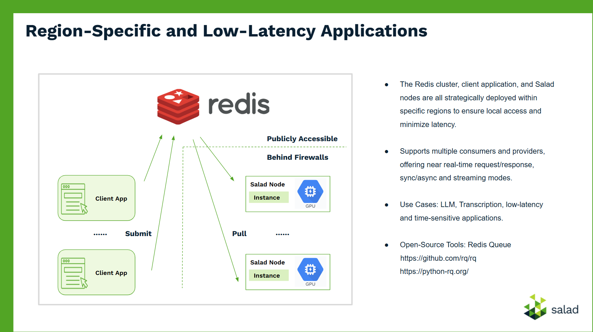

### A simple app using RQ - Redis Queue

The Redis server is set up to listen on port 6379 at the IP address 192.168.68.169. For practical use, the server should be configured for public accessibility.

client.py, submit multiple jobs, then monitors their status and retrieves the results.

worker.py, can be deployed across multiple nodes behind firewalls to process jobs concurrently.

The tasks.py module is imported by both client.py and worker.py, where it defines the implementation of the Fibonacci function.

### Referrence

https://python-rq.org/docs/

https://github.com/rq/rq/tree/master

